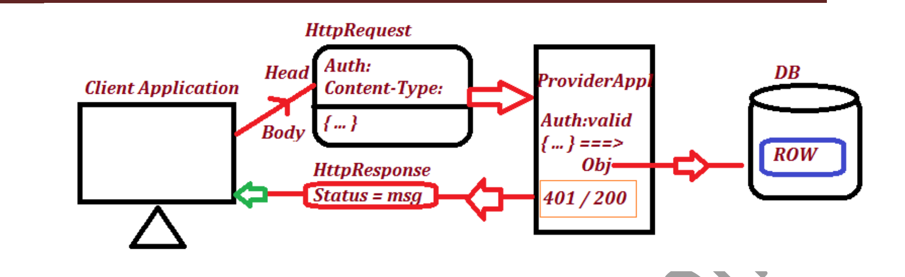

# Jersey_Design1_Assisment
Assessment 

Design: #1

 Make a request from valid client which has valid “Authorization” and
   “Content-Type”.

 In HttpRequest Body send JSON of Employee, this must be converted to
object format and store in DB as a Row.

 In case of invalid request, return with error message

i. 401 – UnAuthorization

ii. 404 – Not Found

iii. 405 – Method not Support

iv. 415 – Unsupported MediaType

 If successfully executed or id already exist returns message with 200- OK

